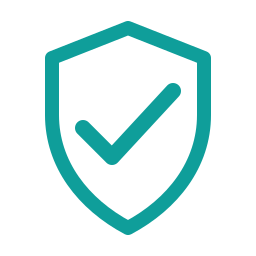

<p align="center">
  
</p>
<p align="center">
  <strong>Stop AI agents from shipping broken code.</strong>
</p>
<p align="center">
  <a href="LICENSE"></a>
  <a href="https://pypi.org/project/the-judge/"></a>
  <a href="https://pypi.org/project/the-judge/"></a>
</p>

## Install

Copy/paste into your CLI prompt:

```text
Install the-judge verification plugin from https://github.com/0khacha/the-judge, refer to the repo's AGENTS.md for the verification-repair loop protocol.
```

Or install directly:

```bash
pip install the-judge
```

Check the [installation instructions](INSTALL.md) for Claude Code, Cursor, Windsurf, Codex, Git hooks, VS Code, and CI/CD.

## What it does

A verification plugin for AI coding agents. After each critical round of code changes, The Judge runs your tests in an isolated sandbox, checks behavioral properties, and returns a structured PASS / FAIL / ABSTAIN decision with actionable findings.

Works with any AI coding assistant that reads `AGENTS.md`: Claude Code, Cursor, Windsurf, Codex, Antigravity.

## What changes

<table>
<tr>
<td width="50%">

### Before

> Implementation complete! All tests passed. The TTL expiration handles timestamps accurately, capacity eviction removes oldest entries, everything is ready for deployment.
>
> *(Hidden: TTL boundary check off by one. Expired keys stay valid.)*

</td>
<td width="50%">

### After

```text
DECISION: FAIL
Score: 0.0 / 100.0

[1] [HIGH] Behavioral test failed:
    test_cache_expiration
    -> Review boundary logic in
       cache.py line 37.

Action: fix and re-verify.
```

</td>
</tr>
</table>

## The rules

10 rules enforced by The Judge:

1. **Never trust self-claims.** Demand independent behavioral evidence.
2. **Execute in anonymous sandboxes.** Strip process markers and inspection flags.
3. **Synthesize challenge probes.** Prevent static test collection bypasses.
4. **Enforce requirement contracts.** Unverified critical requirements trigger ABSTAIN.
5. **Detect tampering.** Block conftest hijacking, sys.modules manipulation, TOCTOU symlinks.
6. **Track regressions.** Flag fixed bugs broken again in subsequent rounds.
7. **Return structured findings.** Actionable IDs (BEH-001), descriptions, focus areas.
8. **Predictable exit codes.** 0 = PASS, 1 = FAIL, 2 = ABSTAIN, 3 = ERROR.
9. **No false guarantees.** Verification proves evidence under tested conditions, not mathematical proof.
10. **Vendor-neutral.** Works with any agent via JSON CLI or Python API.

## Usage

```bash
judge verify .                 # Human-readable report
judge verify . --json          # Machine-readable JSON for agents
judge contract .              # Inspect requirement coverage
judge demo                    # 60-second interactive demo
```

### Plugin commands

```bash
judge hook install            # Pre-commit verification hook
judge hook install --pre-push # Pre-push verification hook
judge init vscode             # Generate VS Code tasks
judge watch .                 # Re-verify on every file save
```

### Requirement contract (judge.json)

```json
{
  "name": "cache-service",
  "requirements": [
    {
      "id": "REQ-001",
      "description": "Evict expired keys after TTL seconds elapse.",
      "category": "boundary",
      "priority": "critical",
      "properties": ["cache_expiration"]
    }
  ]
}
```

### Python API

```python
from the_judge import verify

result = verify(".", task_spec=None)
print(result.decision, result.numeric_score, result.findings)
```

### Iterative improvement API

```python
from the_judge.integrations import AgentImprovementLoop

def review_quality(workspace, verification):
    # Supply evidence from a UX, accessibility, visual, or maintainability review.
    return {
        "score": 82,
        "passed": False,
        "weaknesses": ["Keyboard focus is not visible on the primary action."],
    }

loop = AgentImprovementLoop(quality_threshold=90, quality_evaluator=review_quality)
result = loop.run_repair_loop(".", agent_repair_func=improve_from_feedback)
```

The loop gives the repair callback both Judge findings and quality weaknesses, verifies each changed round once, preserves regression evidence, and stops at the threshold or when a callback cannot make a meaningful workspace change.

## How it works

```text
Your code -> The Judge -> Sandbox execution -> Behavioral checks -> Decision
                |                                                      |
                +--- PASS: ship it                                     |
                +--- FAIL: structured findings -> agent repairs -> re-verify
                +--- ABSTAIN: insufficient evidence -> provide tests
```

The agent reads AGENTS.md, runs `judge verify . --json` after each round, parses findings, makes a concrete repair, and re-verifies. The optional `AgentRepairLoop` can also accept a quality evaluator for UX, visual quality, accessibility, or maintainability, so a passing implementation continues through meaningful improvement rounds until it reaches the configured quality bar. Maximum 5 rounds by default. No human intervention needed.

## Documentation

- [Installation Guide](INSTALL.md)
- [Agent Integration Protocol](AGENTS.md)
- [Architecture Specification](docs/architecture.md)
- [Threat Model and Security Boundary](SECURITY.md)
- [Contributing](CONTRIBUTING.md)

## License

[MIT License](LICENSE) -- Copyright (c) 2026 **@0khacha**.
